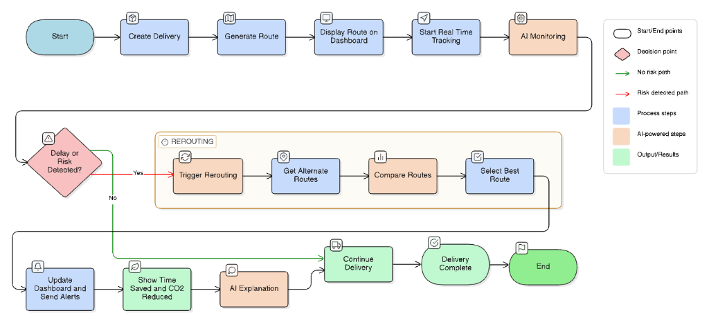
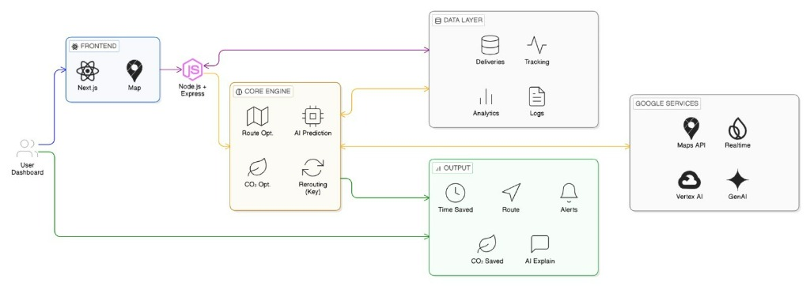
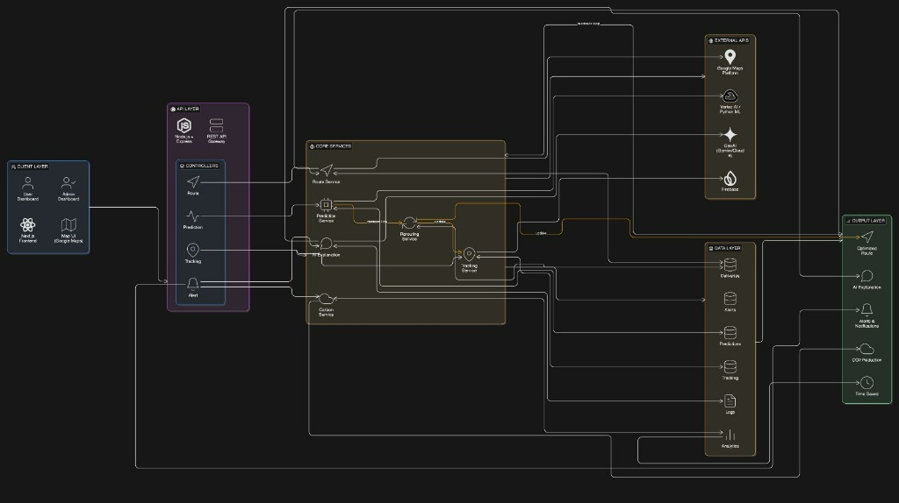
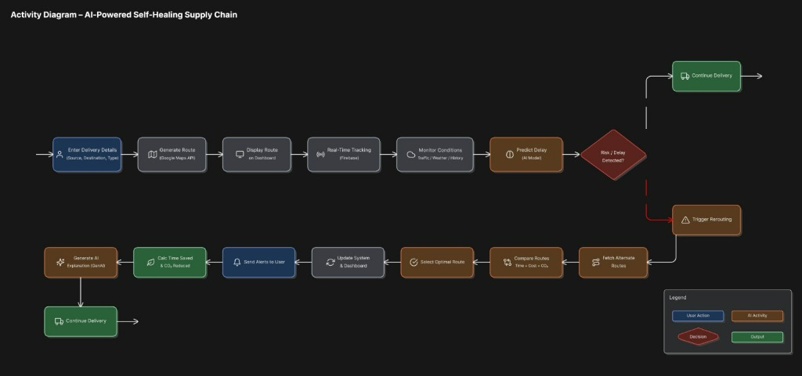
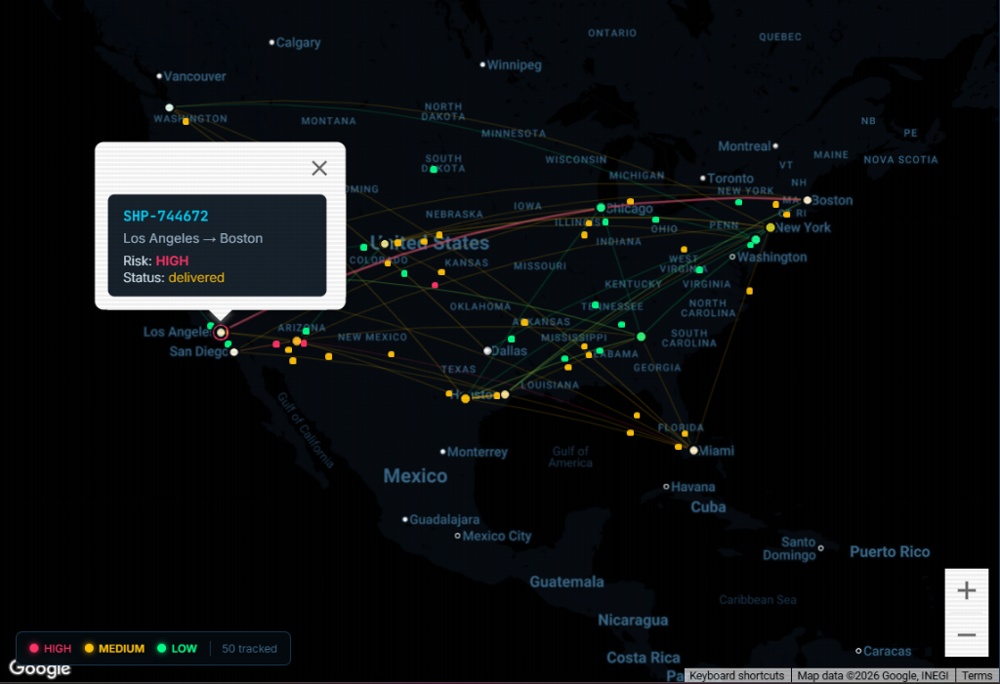
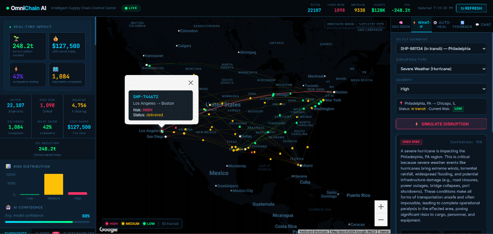

  
  
  <h1>🌐 OmniChain</h1>
  
<strong>Intelligent Supply Chain Control Center powered by Google AI</strong>

  
  

    Built with ❤️ by <strong>Team SPectra</strong> for the <strong>Google Solution Challenge 2026</strong>.
  

---

## 🔗 Live Links
- **🌍 Live Dashboard:** [https://pelagic-height-474717-e7.web.app](https://pelagic-height-474717-e7.web.app)
- **⚙️ Backend API:** [https://api-server-2k3orsn3xq-uc.a.run.app](https://api-server-2k3orsn3xq-uc.a.run.app)
- **📡 Data Engine:** [https://data-pipeline-2k3orsn3xq-uc.a.run.app](https://data-pipeline-2k3orsn3xq-uc.a.run.app)

---

## 🚨 The Problem: Opportunities & Industry Needs

  

### 🏆 Opportunities
- **Rising complexity** in global supply chains → huge demand for **intelligent systems**
- **Growth** in e-commerce, agriculture, and healthcare logistics
- Increasing focus on **sustainable (low-carbon) logistics**
- Adoption of AI and **real-time data systems** in logistics industry
- Easy scalability using **cloud platforms** like Google Cloud

---

## 💡 Our Solution: OmniChain (How We Are Different)

### 🏆 Unique Selling Propositions (USP)
- **Self-Healing Supply Chain** – auto-detects & fixes disruptions
- **AI-Driven Predictive Intelligence** – prevents delays before they occur
- **Carbon-Aware Optimization** – sustainability + efficiency
- **Real-Time Adaptive System** – live tracking + instant decisions
- **Multi-Domain + Scalable** – works across industries & global logistics
- **True AI Feedback Loop** – BigQuery ML models automatically adjust their weights after every delivery based on actual vs. predicted outcomes.

### 🔍 How is it Different from Existing Solutions?
| ❌ Existing Solution | ✅ Our Solution |
| :--- | :--- |
| Existing systems are **reactive** (respond after delay) | Our system is **predictive + proactive** (acts before disruption) |
| **Static** route planning | **Dynamic rerouting** in real-time |
| Focus only on **speed/cost** | **Multi-factor optimization** (time + cost + carbon) |
| **No transparency** | **Explainable AI** (decision reasoning) |

---

## 🌟 Key Features

  

1. **Self-Healing Routing:** Automatically detects disruptions and reroutes deliveries in real-time.
2. **Predictive Analytics:** Forecasts delays using AI before they occur.
3. **Real-Time Tracking:** Provides live visibility of delivery movement.
4. **Dynamic Rerouting:** Continuously updates routes based on current conditions.
5. **Carbon Optimization:** Minimizes CO₂ emissions by selecting greener routes.
6. **Multi-Factor Optimization:** Balances time, cost, and sustainability in decisions.
7. **Smart Alerts:** Instantly notifies users about risks and disruptions.
8. **Explainable AI:** Clearly explains why decisions or route changes are made.
9. **Scalable & Multimodal:** Supports global expansion across road, air, and sea logistics.

---

## 🚀 Innovation & Scalability

  

### 🥇 Innovation
*   **Self-Healing Supply Chain** – system automatically predicts disruptions and fixes them via real-time rerouting
*   **Predictive Intelligence** – uses AI to detect delays before they occur (proactive approach)
*   **Carbon-Aware Optimization** – integrates sustainability by minimizing CO₂ along with time and cost
*   **Multi-Factor Decision Engine** – optimizes across time, cost, and environmental impact simultaneously
*   **Explainable AI** – provides clear reasoning behind routing and optimization decisions
*   **Multi-Domain Adaptability** – one platform works for agriculture, medical, and e-commerce logistics

### 📈 Scalability
*   **Cloud-Native Architecture** – built on scalable infrastructure (auto-scale based on demand)
*   **Global Expansion Ready** – supports region-wise deployment across countries
*   **Multimodal Support** – extendable to road, air, and sea logistics
*   **Handles Large Data Volume** – processes real-time tracking + historical data efficiently
*   **Modular Microservices Design** – easy to add new features/services without affecting system
*   **Industry-Agnostic** – adaptable to multiple logistics domains and use cases

---

## 🏗️ System Architecture & Process Flow

### 🌊 Process Flow

  

### 🧩 High-Level System Architecture

  

### 🔧 Low-Level System Architecture

  

### 📊 Activity Diagram

  

---

## 💻 Prototype Screenshots

  

 

  

---

## 🛠️ Google Technologies & Services Used
We built OmniChain leveraging the best of the Google ecosystem to ensure seamless integration, high availability, and cutting-edge AI capabilities:

*   🧠 **Google Gemini 2.5 Flash API:** Used for real-time natural language reasoning. It analyzes telemetry data and generates human-readable disruption reasons and mitigation strategies.
*   🤖 **Google Genkit:** Utilized as the orchestration framework to seamlessly integrate Gemini AI into our Node.js data pipeline.
*   ☁️ **Google Cloud Run:** Hosts our containerized Backend API and Data Pipeline, providing autoscaling to handle sudden spikes in global logistics traffic.
*   📨 **Google Cloud Pub/Sub:** Acts as the nervous system of our app, streaming thousands of mock shipment events asynchronously.
*   📊 **Google BigQuery & BigQuery ML:** Serves as our enterprise data warehouse. We use BQ to store shipment history and utilize **BigQuery ML** to train Logistic Regression models directly on our data to predict future delays.
*   🔥 **Firebase Hosting:** Deploys our Vite/React frontend with global CDN caching for ultra-fast load times.
*   🗺️ **Google Maps JavaScript API:** Powers the dynamic, interactive dashboard map showing live coordinates, custom markers, and active transit routes.

---

## 🌍 Impact & Scalability
### **Impact**
OmniChain specifically addresses the **United Nations Sustainable Development Goals (SDGs)**:
- **SDG 9 (Industry, Innovation, and Infrastructure):** By optimizing routing, we increase the resilience of global infrastructure.

- **SDG 12 (Responsible Consumption and Production):** By reducing transit times and preventing perishable goods from expiring during delays, we directly reduce global waste and lower carbon emissions.

### **Scalability**
Because the architecture is entirely serverless (Pub/Sub + Cloud Run + BigQuery), OmniChain can scale from 10 shipments to 10 million shipments per second with zero changes to the underlying infrastructure. 

---

## 🚀 Future Scope
In the future, we plan to expand OmniChain by:
1. **IoT Integration:** Connecting real-time temperature, humidity, and shock sensors for pharmaceutical logistics.
2. **Automated Execution:** Allowing the AI to directly communicate with carrier APIs to automatically reroute shipments without human approval.
3. **Multi-Modal Transport:** Adding support to calculate carbon footprints across maritime, air, rail, and road to suggest the most eco-friendly mitigation strategies.

---

## 💰 Cost Estimation (Google Cloud Free Tier Strategy)
OmniChain is designed to be extraordinarily cost-efficient by taking full advantage of serverless architectures and Google Cloud's Free Tier:
- **Cloud Run:** Only runs when processing data. Free tier covers 2 million requests per month.
- **Cloud Pub/Sub:** First 10 GB of messages per month are free.
- **BigQuery:** 1 TB of querying and 10 GB of storage are free per month.
- **Gemini API:** Generous free tier quotas for reasoning and natural language processing.
- **Firebase Hosting:** Free bandwidth for standard usage.

*Our modular microservices design ensures we only pay for exactly what we compute, keeping operational costs near zero during testing and highly predictable at scale.*

---

## 🌍 Impact on UN Sustainable Development Goals
OmniChain specifically addresses:
- **SDG 9 (Industry, Innovation, and Infrastructure):** Increasing the resilience and efficiency of global infrastructure through intelligent automation.
- **SDG 12 (Responsible Consumption and Production):** Reducing global waste (especially perishable goods) by avoiding delays, and directly lowering carbon footprint via our Carbon-Aware Optimization.

---

  
<strong>Team SPectra</strong>

  
<em>Innovating for a resilient tomorrow.</em>

